# Kali Linux, Scanning and Metasploit

## Introduction
In this lab we will explore Kali Linux and the variety of scan commands we can use inside of the operating system and machine. We will also use Metasploitable to utilize exploits and scan commands in a real scenario.

## Setup
Prerequisites: 
* Over 60GB avaliable storage space
* Computer capable of virtualization and running VMs
* Virtualization needs to be enabled

## Step 1: Install VMWARE
The first step of this lab is installing the latest edition of VMWARE Workstation Pro. VMWARE was released in 1999 and was recently made free by Broadcom. Its primary value is as a hypervisors for running virtual machines. When I isntalled it on my own PC I encountered no issues because virtualization was already enabled. Upon completing configuration and launching the application you should land on the same screen that I did shown in figure 1.

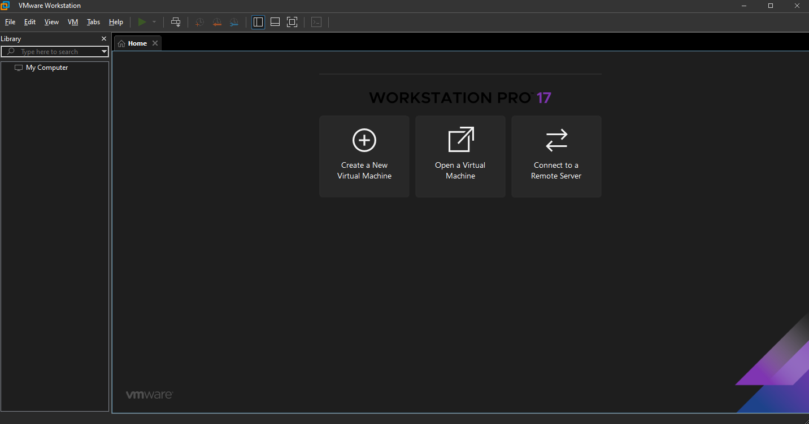

## Step 2: Install Kali Linux
The next step is to install Kali Linux. Kali linux was released in 2013 and is a Debian operating system designed for digital foresnics,pentesting and security auditing. For this I will use Kali.org which is the standard site to download kali from. I donwloaded the ISO file and will “Create a New Virtual Machine” in VMWARE and direct the installer to the location of the ISO file when prompted. Upon compeltion of setting up the Virtual Machine using the ISO file you will be greeted with your new virtual machine. 

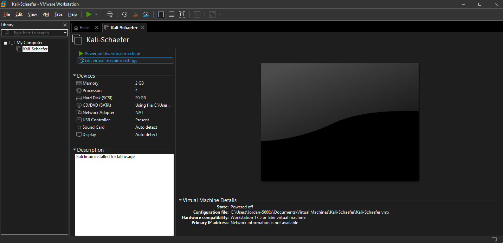

From this screen the next step is to finally launch the new virtual machine by clicking the “Power on this virtual machine” button. Once you do this you will setup your kali linux machine by following the on screen directions. At the end of the setup you should be met with this screen.

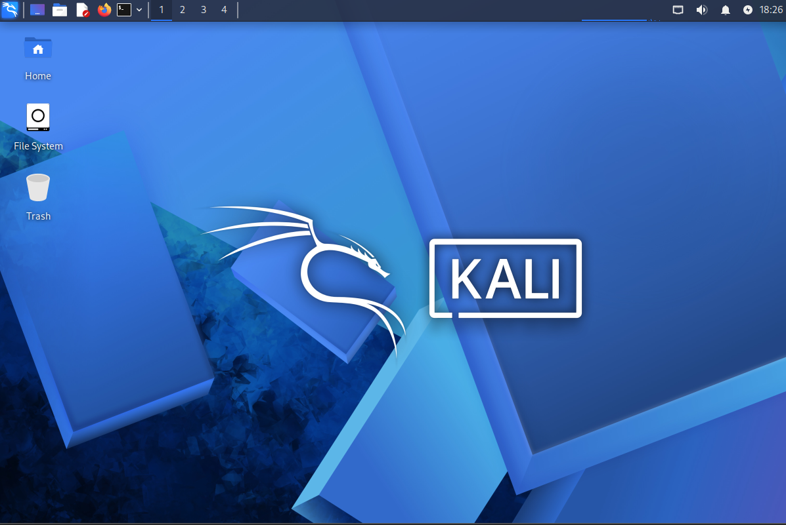

After installation I opened the terminal and ran `sudo apt update && sudo apt upgrade -y` to ensure the system was up to date.

## Step 3: Install METASPLOITABLE 2
The next step is to download the Metasploitable 2 virtual machine from the official SourceForge page. Metasploitable is a deliberately vulnerable ubuntu based machine designed for testing. From here I will grab the .vmdk file from the zip file and use that to create my new virtual machine. Yet again I click to create a new machine and use advanced/custom setup. But this time I select to install the operating system later and choose my guest OS as Ubuntu since metasploitable is based on Ubuntu. Once we are required to specify the disk capacity we will use an existing virtual disk and click on the .vmdk file. Since metasploitable is an intentionally virtual enviornment based on ubuntu we do not install and ISO file and instead install a virtual machine disk file to make this intentionally vulnerable machine.  

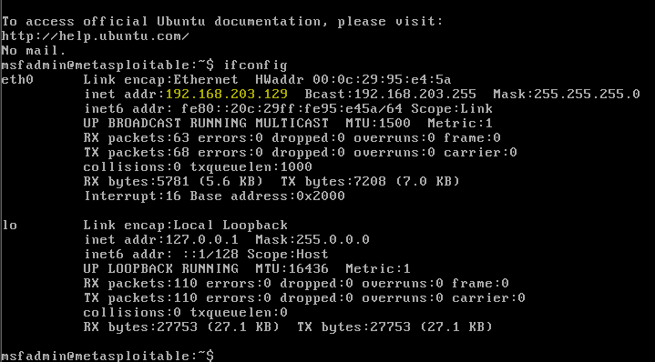

Now that metasploitable is installed I get the IP address by using the command ifconfig as shown in Figure 4.

# Active Lab

## Part 1. NMAP Scanning
First I need to find my metasploitable IP subnet to use the nmap tool. NMAP is a command line tool used for network discovery, vulnerability scanning and network auditing. It acts as my eyes and allows me to map out an entire network by sending out custom packets to target machines and analyzing their response. In this case my subnet is 192.168.203.0/24. The next step is to open my kali terminal and use the nmap command with the -sn command to do a ping scan/sweep.  

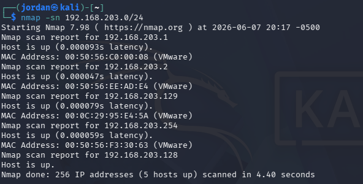

In this specific ping sweep we found 2 default gatewats, a broadcast/management service interface and the standard DHCP Ips for Virtual machines. One is my current kali machine and the other is the metasploit machine (ending in 129).

Next I will use the -A command in nmap and the specific IP of my metasploit VM to find the OS,version, do script scanning and traceroute.  

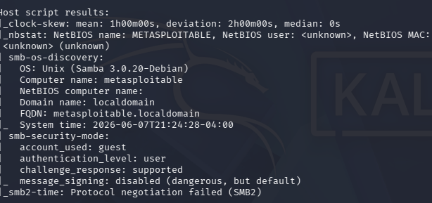

Figure 6 is a snippet of the key results from the -A scan. This shows many details like the name of the computer, the operating system and even security modes. I then ran the command `nmap -A 192.168.203.129 > intense_scan_results.txt` to create a txt file for later use to do a detailed analysis.

The next part of NMAP scanning will be utilizing the -sV scan which is less intensive than the -A command and is utilized to have less of an impact on the network.

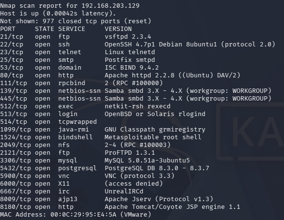

## Part 2. Metasploit Scanning
Now transitioning from doing simple scans to scanning the metasploitable scans. Metasploit is a framework used for open source penetration testing. It has lots of verified exploits, payloads and scanning tools which will allow me to discover and exploit vulnerabilities in networks and software. First I need to initialize the metasploit database on my kali machine using the command `sudo msfdb init` and then launch the metasploit framework by using `msfconsole`. Then I use metasploits native Nmap function to do a scan which results in the following result.

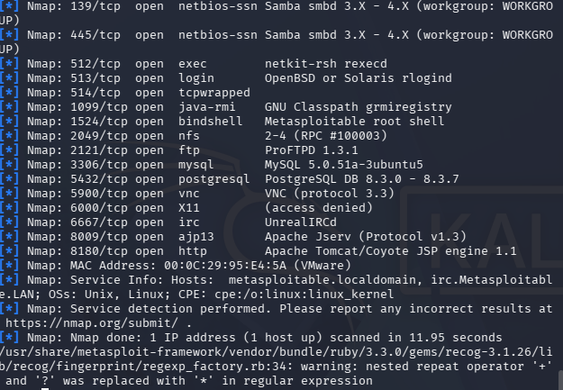

The next step from here is searching for a vulnerable exploit to use on my metasploit machine using search ftp (Found 565 valid exploits). Now I will use the exploit `use exploit/unix/ftp/vsftpd_234_backdoor` and configure it with the metasploitable ip using `set RHOSTS [Metasploitable IP]`. This will use exploit 234 on my metasploitable machine. From here the next step is to set the payload. In this case I use `set payload cmd/unix/interact` to allow for command line interaction. Then run the exploit using the exploit command. Upon doing this we are entered into the command shell with the following output.

92.168.203.129:21 - Found the backdoor service on port 6200!
192.168.203.129:21 - Sending trigger...
Command shell session 1 opened...

## Part 3. Masscan Scanning
To begin the Masscan Scanning we will use the command `sudo masscan -p80 192.168.203.0/24` to perform a simple scan first.  

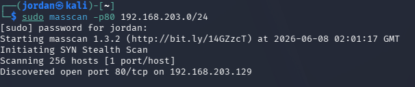

I also run `sudo masscan -p80 192.168.203.0/24 --rate=1000` to demonstrate masscans ability to scan 100 packets per second. Then `sudo masscan -p80,443 192.168.203.0/24` to scan multiple ports. For the last scan I use `–echo > mssample1.txt` to save my output to a file. I then run a command `sudo masscan 192.168.1.0/24 -p80,22,443 --banners --rate 1000 -e eth0` to demonstrate the banner addition.  

## Part 4. Wireshark Traffic Analysis
Wireshark is a traffic analysis tool we can use on Kali and other devices. Wireshark is pre installed on kali linux and is an open source packet analyzer that I can use for network troubleshooting,analysis, software development and security auditing. It is like a microscope for network traffic that allows me to intercept, log and view the raw data passing back and forth on a network. The first step to using this on Kali is opening wireshark. Now that wireshark is open and capturing traffic from eth0 I will run the command `nmap -sV 192.168.203.129`.  

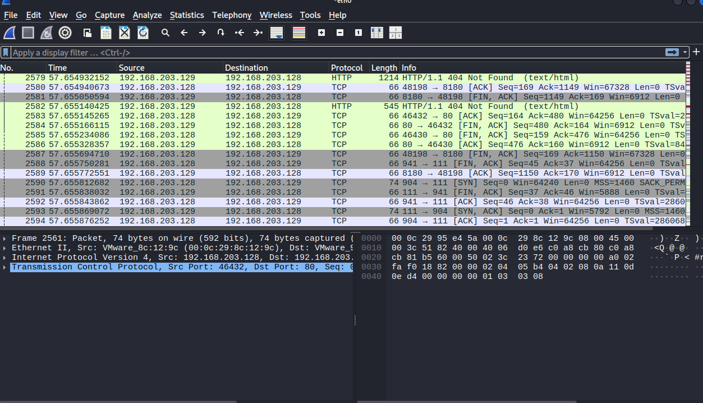

After completing the Nmap command I stop the traffic capture to observe the SYN, Ack, SYN-ACK relationships captured. If during this traffic capture we had found any sensitive data on the HTTP protocol (Not HTTPS) we would likely be able to see sensitive data in plaintext by just oberving the packet.
Now capturing Masscan scans on wireshark. We run `sudo masscan -p80 192.168.203.0/24` to do a scan on the vulnerable machine.  

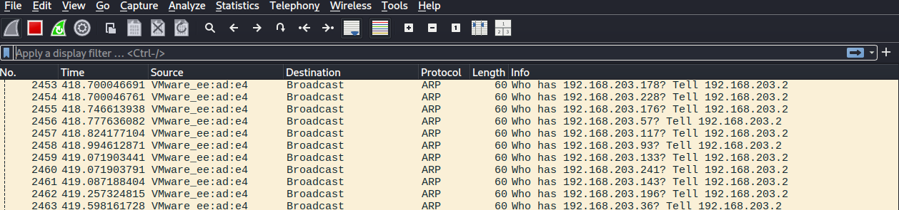

Our first capture shows a mixture of HTTP application layer traffic and TCP connection between my kali machine and metasploitable. Whereas the second masscan we looked through a wide lens where it found what hosts were even active on the subnet before it attempted to hit port 80.

## Conclusion
In this lab I demonstrated the ability to use VMWare to install Kali Linux alongside and vulnerable machine Metasploit. After installation I used basic scan commands to find the other machine and find out information about the other machine. I then used metasploit to find and utilize exploits against the metasploitable machine thus giving me access to the shell inside the metasploitable machine. After this I explored the wireshark inside of my kali linux machine, captured traffic for an nmap scan and a masscan scan.

## Works Cited
VMware Workstation Pro. Version 17,Broadcom Inc., 2024.
Wireshark. Version 4.2, The Wireshark Foundation, 2024.
Metasploitable 2. Rapid7, 2012.
Metasploit Framework. Rapid7, 2026.
Kali Linux. Version 2026.1, OffSec, 2026.
Graham, Robert David. Masscan. Version 1.3, GitHub, 2023.
Lyon, Gordon "Fyodor". Nmap Security Scanner. Version 7.95, Insecure.Org, 2024.
